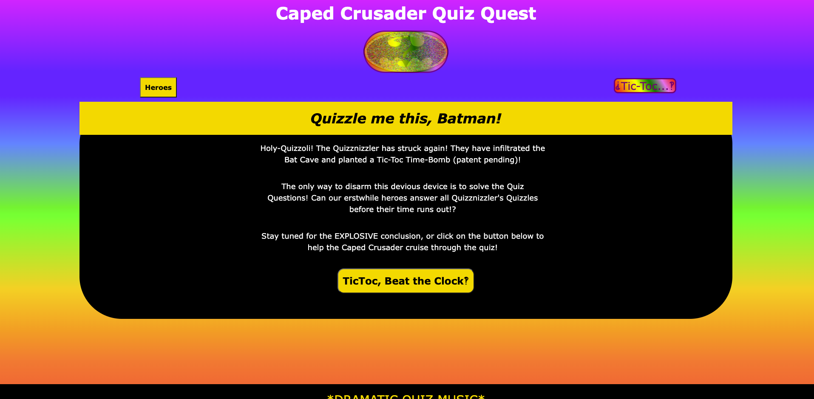
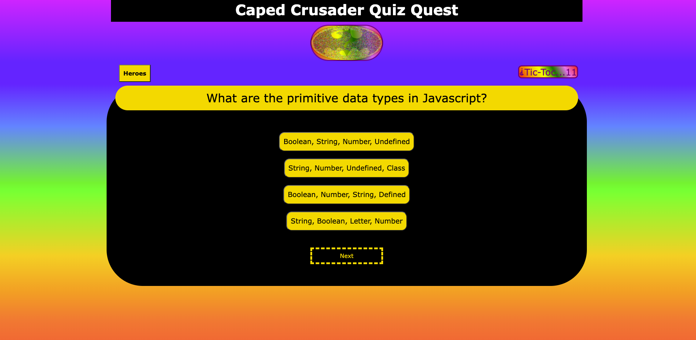
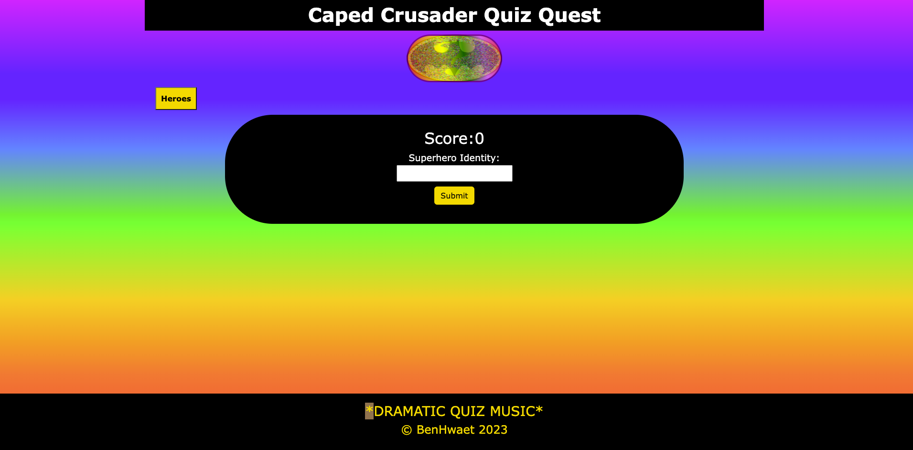

# Quizzle-Me-This

Timed Quiz - Challenge for Week 4

## Description

This challenge's purpose is to create a timed quiz using Javascript, where correct answers add time and incorrect answers subtract time from the timer. The user must be able to enter their name to register their score in local storage and also view a list of all the scores. The user story and acceptance criteria provided are as follows:

### User Story

```text
AS A coding boot camp student
I WANT to take a timed quiz on JavaScript fundamentals that stores high scores
SO THAT I can gauge my progress compared to my peers
```

### Acceptance Criteria

```text
GIVEN I am taking a code quiz
WHEN I click the start button
THEN a timer starts and I am presented with a question
WHEN I answer a question
THEN I am presented with another question
WHEN I answer a question incorrectly
THEN time is subtracted from the clock
WHEN all questions are answered or the timer reaches 0
THEN the game is over
WHEN the game is over
THEN I can save my initials and my score
```

## Usage

The user begins the quiz by pressing on the 'TicToc' start button. The timer of 30 seconds begin sand the user is then be presented with multiple choice questions and answers. When the user clicks on an answer, there will be an indications to show if the answer was correct or incorrect. When an answer is correct 5 seconds will be added to the clock, when it is incorrect 5 seconds will be subtracted from the clock. Should the timer count down to zero before the quiz is complete, Batman and Robin will die (and the user will fail the quiz).
Included below are images of the four website states: welcome page, question page, name entering page, and the highscore viewing page, the last of which is not yet functional and will be a modal element.


Preview:





## Progress

The application is currently able to display all quiz questions and advance to the next question by clicking the nextBtn. The goal is to target the buttons or innerHtml of the choices to change the buttons' background colour through CSS manipulation -- green for correct answers and red for incorrect answers. At the same time, the buttons will be associated to a time increase or time decrease; they will also update the total score to be tallied and displayed as an ordered list in the highscoreContainer/Modal.

The deployed website is on GitHub Pages at <https://benhwaet.github.io/Quizzle-Me-This/> and the repository is accessible here <https://github.com/Benhwaet/Quizzle-Me-This>.

## Credits

The providedREADME and User Story were provided by edX during the course of a bootcamp hosted by the University of New Brunswick (UNB). The basic form of the HTML and Javascript codes were heavily influenced by the Javascript quiz constructed by ehoversten on GitHub, one of many users who must have had similar assignments (<https://ehoversten.github.io/quiz_game/>). I have not copy pasted any of their code and have tried to make my own while taking inspiration from the structure of their quiz and code.
Some bootstrap code was also used to help CSS formatting and add certain elements.

All Batman images were found in the public domain and the graphics were added through Canva. (<canva.com>)

## License

This project uses the MIT License, which can be read in full in the repository for this project at <https://github.com/Benhwaet/Quizzle-Me-This>.
[EOF]
